# OpenWrt Custom Sing-Box 1.12.25 (v-mmo Butler Architecture)

Tài liệu chuẩn hóa toàn bộ kiến trúc, cơ chế điều phối và hướng dẫn vận hành phiên bản **`sing-box 1.12.25 v-mmo Butler`** chuyên biệt cho Router OpenWrt (đặc biệt tối ưu cho môi trường RAM nhỏ 240MB, ZRAM 238MB, và chạy 13–20 tiến trình Passwall2 đồng thời).

---

## 1. Tổng quan Kiến trúc & Nhánh Git

* **Repository**: `https://github.com/mmosonglo/sing-box-v-mmo.git`
* **Nhánh hoạt động (Active Branch)**: `v1.12-butler`
* **Phiên bản nền**: `sing-box 1.12.25` (Go 1.23+)
* **Triết lý cốt lõi**: *"Chuẩn Repo Gốc + 1 Trợ Lý Tiếp Nhận Ngoại Vi"*:
  - **Không xâm lấn Go Runtime**: Không ép chu kỳ dọn rác định kỳ làm phiền Go pacer khi đang có kết nối truyền tải dữ liệu.
  - **Trợ lý gác cổng ngoại vi**: Điều phối tuần tự ở cửa ngõ khởi động tiến trình (Startup Gate) và cửa ngõ kết nối (PreDial Gate).

---

## 2. Cơ chế Hoạt động của Trợ lý `v-mmo Butler`

```mermaid
flowchart TD
    subgraph Gate1["Trạm Gác 1: Tiếp nhận Khởi Động (Startup Gate)"]
        PW["Passwall2 Khởi động nhiều node"] --> Lock["Khóa hệ điều hành /tmp/sing-box-startup.lock"]
        Lock --> Queue["Hàng chờ Tuần tự (Chỉ 1 node khởi tạo tại 1 thời điểm)"]
        Queue --> Survey["Khảo sát RAM thực tế (/proc/meminfo & /proc/*/statm)"]
        Survey --> CheckRAM{"RAM Khả dụng >= 8MB?"}
        CheckRAM -- CÓ --> Boot["Nạp cấu hình JSON & Khởi động box"]
        CheckRAM -- KHÔNG --> Wait["Hàng chờ 'Ok đợi chút' (500ms, tối đa 10s)"]
        Wait --> Survey
        Boot --> TrimInit["Dọn dẹp One-Shot thu nhỏ heap về ~3.8MB"]
        TrimInit --> Unlock["Nhả khóa flock cho tiến trình tiếp theo cất cánh"]
    end

    subgraph Gate2["Trạm Gác 2: Cân Bằng Kết Nối (PreDial Gate)"]
        Inbound["Kết nối từ Client MMO"] --> PreDial["route/conn.go: PreDial Admission Check"]
        PreDial --> FairShare["Điều tiết hạn ngạch công bằng theo số lượng máy thực tế"]
        FairShare --> DialOut["Mở Outbound Socket"]
    end

    subgraph Memory["Bảo Vệ Bộ Nhớ Hài Hòa (Memory Harmony)"]
        ActiveTraffic["Khi có lưu lượng: Go GC chuẩn (GOGC=100, 0% CPU spike)"]
        DeepIdle["Khi nhàn rỗi 45s: Dọn rác One-Shot đưa node về 3.8MB"]
        EmergencyTrim["Khi nguy cấp (RAM < 8MB): Cứu hộ khẩn cấp (giãn cách >= 60s)"]
    end
```



### 🚪 Trạm 1: Cửa ngõ Cất cánh Tuần tự (`AcquireStartupGate`)
* **Khóa POSIX `flock` độc quyền**: Đặt tại `/tmp/sing-box-startup.lock`. Khi Passwall2 reload và bắn 13–20 node cùng lúc, các node xếp hàng trật tự tại tầng OS (CPU 0%, RAM chưa cấp phát).
* **Dự báo RAM an toàn (`surveySingBoxMemoryCost`)**: Đo mức tiêu thụ RAM thực tế của các node anh em qua `/proc/*/statm`. Nếu `MemAvailable` trừ đi dự toán $< 8\text{MB}$, node tự động đợi 500ms để node cũ nhả RAM vào ZRAM.
* **Thu hồi bộ nhớ One-Shot**: Ngay khi node nạp xong cấu hình, nó gọi `runtime.GC()` và `debug.FreeOSMemory()` 1 lần duy nhất để thu hồi ~11MB bộ nhớ tạm JSON, đưa RAM về mức nền ~3.8MB trước khi nhả khóa cho node sau.
* **Không bao giờ Deadlock**: Khóa POSIX `flock` gắn liền với file table của Linux Kernel; nếu tiến trình bị `kill -9` hoặc crash, kernel sẽ tự động giải phóng khóa ngay lập tức.

### ⚖️ Trạm 2: Cửa ngõ Kết nối PreDial (`butler.Acquire`)
* **Chặn trước khi Dial**: Kiểm tra hạn ngạch kết nối trong [`route/conn.go`](file:///home/mmo/sing-box/route/conn.go) ngay trước khi cấp phát socket mạng, loại bỏ lãng phí tài nguyên và bảo vệ bảng `conntrack` của Linux.
* **Hạn ngạch Công bằng (Fair-Share)**: Tự động tính toán hạn ngạch dựa trên RAM thực tế và số lượng client MMO đang hoạt động.
* **Thu hồi chính xác**: Gắn hàm `Release` vào `onClose` với `sync.Once` đảm bảo không bao giờ bị rò rỉ (leak) bộ đếm kết nối.

### 🧹 Cơ chế Dọn dẹp Thông minh ("Tự nhiên khi làm việc — Gọn gàng khi nghỉ ngơi")
* **Khi có tải (Active Traffic)**: Go Runtime chạy 100% tự nhiên (`GOGC=100`, không gọi `FreeOSMemory`), bảo toàn bộ đệm gói tin `mcache`, 0% CPU spike, độ trễ mạng thấp nhất.
* **Khi nhàn rỗi (Deep Idle $\ge 45$s)**: Kích hoạt dọn rác **One-Shot duy nhất 1 lần** (`isDeepCleaned.Swap(true)`), đưa node về trạng thái ngủ đông ~3.8MB mà không lặp lại tốn CPU.
* **Hài hòa với ZRAM**: Chỉ kích hoạt dọn rác khẩn cấp khi cả RAM vật lý lẫn Swap đều cạn kiệt, có khoảng nghỉ cưỡng bức tối thiểu 60 giây chống bão CPU.

### 📜 Nhật ký Hệ thống `v-mmo`
* Toàn bộ trạng thái tiếp nhận, cấp phép, và điều tiết tải được gửi trực tiếp vào OpenWrt syslog (`/dev/log`) dưới nhãn định danh **`v-mmo`**:
  ```
  daemon.info v-mmo: [Tiếp nhận] Cấp phép khởi động tiến trình #14 (Dự toán: 4MB, RAM khả dụng: 118MB)
  ```

---

## 3. Các Thành phần Đã Cắt Giảm để Tối ưu Kích thước

* **Cắt bỏ công cụ CLI nặng**: `cmd_geoip.go`, `cmd_geosite.go`, `cmd_rule_set_*.go`, `cmd_tools_*.go`, `cmd_format.go`, `generate_completions.go`.
* **Cắt bỏ module không cần thiết**: Clash API, WireGuard, Tailscale, DERP, Tor, SSH, AnyTLS, gVisor, Inbound Server modules (Router chỉ làm Client).
* **Kết quả**: Binary giảm từ **18MB** xuống còn **~14.6MB** (tiết kiệm đáng kể dung lượng bộ nhớ flash/RAM của router).

---

## 4. Bảng Kích thước Binary & Đường dẫn trong Dự án

| Kiến trúc | Đường dẫn Binary | Kích thước | Mô tả |
| :--- | :--- | :--- | :--- |
| **ARM64** | [`release/butler/sing-box_1.12.25_openwrt_arm64`](file:///home/mmo/sing-box/release/butler/sing-box_1.12.25_openwrt_arm64) | **14.6 MB** | Dành cho Router Cortex-A53 / MT7981 / ARM64 |
| **AMD64** | [`release/butler/sing-box_1.12.25_openwrt_amd64`](file:///home/mmo/sing-box/release/butler/sing-box_1.12.25_openwrt_amd64) | **15.4 MB** | Dành cho Mini PC x86, J4125, N100, PC Router |
| **MT7621** | [`release/butler/sing-box_1.12.25_openwrt_mt7621`](file:///home/mmo/sing-box/release/butler/sing-box_1.12.25_openwrt_mt7621) | **16.5 MB** | Dành cho Router MIPSle (softfloat) |

---

## 5. Hướng dẫn Biên dịch & Chạy Kiểm thử

### 🧪 Chạy Kiểm thử Đơn vị (Unit Tests):
```bash
export PATH=$PATH:/home/mmo/.local/go/bin
go test -v -race ./common/butler/...
```

### 🛠️ Lệnh Biên dịch Đồng loạt (`make openwrt_all`):
```bash
export PATH=$PATH:/home/mmo/.local/go/bin
make openwrt_all
```

---

## 6. Cẩm nang Vận hành & Giám sát trên Router OpenWrt

### 🔍 1. Theo dõi Trợ lý Tiếp nhận hoạt động:
```bash
logread -f -e "v-mmo"
```

### 📊 2. Kiểm tra bộ nhớ RAM thực tế từng tiến trình:
```bash
for pid in $(pgrep sing-box); do
    echo "--- PID $pid ---"
    grep -E 'VmRSS|VmHWM' /proc/$pid/status
done
```

### 🚦 3. Kiểm tra tình trạng hàng chờ và khóa cất cánh:
```bash
ls -l /tmp/sing-box-startup.lock
fuser /tmp/sing-box-startup.lock
```
